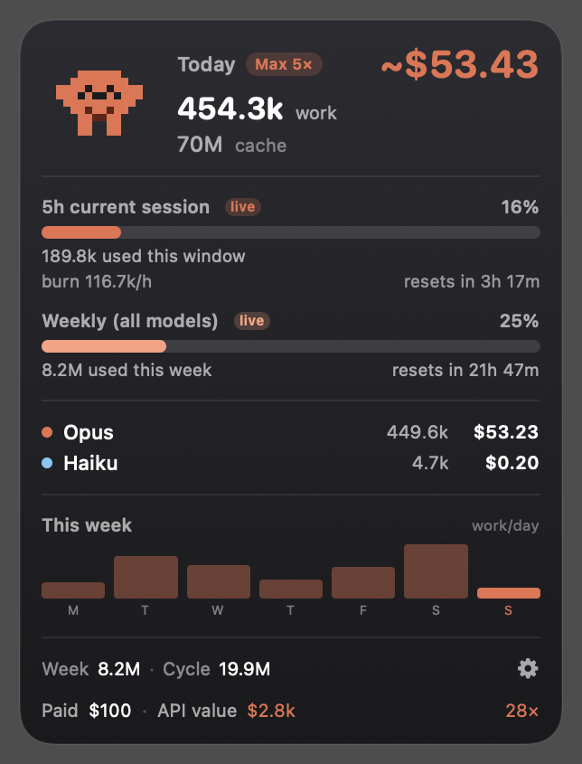
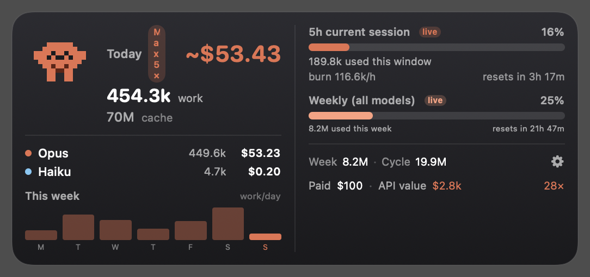
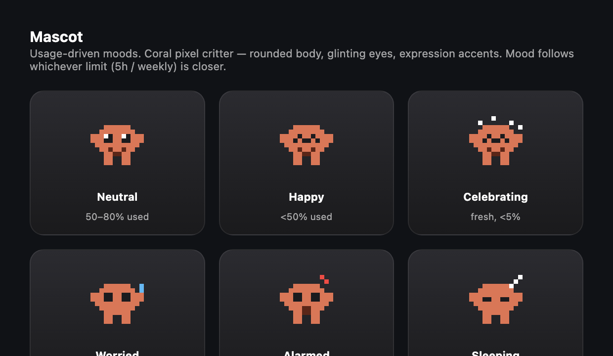

# ClaudePet 🐾

A tiny native-macOS desktop pet that watches your Claude usage. A coral pixel critter sits on
your desktop and shows, at a glance, how close you are to your limits — reading your **local**
Claude Code logs only. **No API key, no network, no token.**

<p align="center">
  
  &nbsp;&nbsp;
  
</p>

## What it shows

- **Today** — work tokens (input + output), total billable tokens (incl. cache), and notional cost.
- **5-hour session** — a gauge toward your limit (live from Claude's real numbers when available),
  burn rate, and a reset countdown.
- **Weekly (all models)** — your 7-day usage with its own reset countdown.
- **By model** — Opus / Sonnet / Haiku split with tokens + cost (unpriced models flagged).
- **This week** — a per-day bar chart, plus Week & cycle totals and a billing line.
- An **ambient pixel mascot** whose mood tracks how close you are to a limit — happy with
  headroom, worried near a cap, asleep when you're away.

## Install (macOS 14+)

1. Download **`ClaudePet-x.y.z.dmg`** from the [Releases](../../releases) page.
2. Open the DMG and **drag ClaudePet to Applications**.
3. **First launch only** — the app is signed ad-hoc (not via a paid Apple Developer account), so
   macOS Gatekeeper asks for a one-time confirmation:
   - **Right-click** `ClaudePet` in Applications → **Open** → **Open** in the dialog. *(Just
     double-clicking the first time will refuse — use right-click → Open.)*
   - Or, in Terminal: `xattr -dr com.apple.quarantine /Applications/ClaudePet.app`

After that it opens normally. It's a **dockless agent** (no Dock icon) — the pet just appears on
your desktop. Drag it anywhere; it floats above other windows, shows on all Spaces, and remembers
its position. Enable **Launch at login** in Settings to keep it around.

## Using it

- **Drag** the pet to reposition. Hover to reveal resize handles.
- Click the **⚙ gear** for Settings.
- Two layouts (Settings → Appearance): **tall** single-column and **wide** two-column.
- Hover the gauges/numbers for tooltips explaining each value.

## Live data — link to your Claude account

Out of the box, ClaudePet *estimates* your limits from local logs. To show Claude's **real**
5-hour and weekly usage (a **`live`** badge on the gauges), link it to your account through
[**claude-statusline**](https://github.com/andrewii23/claude-statusline) — a separate tool that
authenticates and writes a small local usage cache. ClaudePet only *reads that file*; it never
touches your token or the network.

1. **Install claude-statusline** following its README.
2. **Add it as your Claude Code status line** in `~/.claude/settings.json`:
   ```json
   "statusLine": { "type": "command", "command": "bash ~/.claude/statusline.sh" }
   ```
   The first run authorizes it against your Claude account.
3. **Use Claude Code once** so the status line runs — it writes
   `/tmp/claude/statusline-usage-cache.json`.
4. Done: ClaudePet has **"Use Claude's live usage"** on by default (Settings → *Match the Claude
   app*) and picks up the cache automatically — the gauges switch to Claude's real % with a `live`
   badge. No live data yet? You can still **calibrate** the gauges by hand in Settings to match
   what `/usage` shows.

> ClaudePet reads **only** the local cache file — no OAuth token, no network. claude-statusline is
> the component that links to your account; install it only if you're comfortable with that.

## Settings (⚙)

Budget source (auto-peak / plan / custom), tokens-vs-US$ unit, live-data toggle (reads
[claude-statusline](https://github.com/andrewii23/claude-statusline)'s local cache when present
for Claude's *real* numbers), manual calibration, billing-this-cycle, widget size, layout,
launch-at-login, and an editable pricing table.

## Privacy

ClaudePet reads only local files under `~/.claude` (your transcripts, `~/.claude.json`, and —
if installed — the statusline's local cache). It **never** reads your OAuth token, and it makes
**no network requests**. Token counts come straight from your transcripts; cost is a *notional*
API-equivalent estimate (you're likely on a subscription).

## Uninstall

Quit (Settings → Quit, or `pkill -x ClaudePet`), then drag `/Applications/ClaudePet.app` to the
Trash. Preferences live in `~/Library/Preferences/com.napat.ClaudePet.plist`.

## Design system

The widget's look is mirrored as a small, self-contained HTML component library in
[`frontend/`](frontend/) — colours, typography, the mascot's six moods, the gauges, and both
widget layouts. Open any file in a browser to preview it, or import the whole set into
[claude.ai/design](https://claude.ai/design) with the `/design-sync` skill. Details in
[`frontend/README.md`](frontend/README.md).

<p align="center">
  
</p>

## Build from source

Requires Xcode 16 / Swift 6 on macOS 14+.

```bash
git clone https://github.com/jjnnaappaatt/ClaudePet.git
cd ClaudePet
swift test            # data-engine unit tests
./bundle.sh release   # build ClaudePet.app (ad-hoc signed, non-sandboxed)
open ClaudePet.app
./release.sh          # optional: package dist/ClaudePet-<version>.dmg
```

**Architecture:** `ClaudePetCore` is pure, unit-tested Swift (models, JSONL parser + dedup,
aggregator, 5-hour/weekly engines, pricing, `MetricsStore`, mascot logic). The app layer is a
`FloatingPanel` (NSPanel) hosting SwiftUI, with a pixel-matrix mascot renderer. A web mirror of
the UI (for [claude.ai/design](https://claude.ai/design)) lives in `frontend/`.

## License

[MIT](LICENSE) © 2026 JJ_NAPAT.
